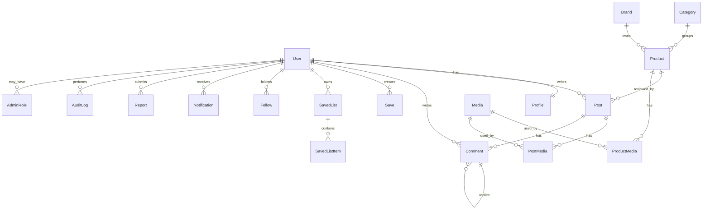

# DATA_MODEL.md

## Phase 2 Data Status

No database, ORM, migrations, schema files, or seed scripts were created in Phase 2. This document remains the planning reference for Phase 4 Backend Core.

## Principles

- PostgreSQL is the target database.
- Rating scale is 1 to 10.
- No Likes, Hearts, Reactions, PostLike, CommentLike, or Reaction tables.
- Use soft deletion for user-generated content.
- Use audit fields on important entities.
- Backend owns validation, authorization, and moderation state.

## Core Entities

### User

- `id`
- `phone`
- `status`
- `createdAt`
- `updatedAt`
- `deletedAt`

### Profile

- `id`
- `userId`
- `username`
- `displayName`
- `bio`
- `city`
- `avatarMediaId`
- `isPrivate`
- `createdAt`
- `updatedAt`

### OtpChallenge

- `id`
- `phone`
- `codeHash`
- `purpose`
- `expiresAt`
- `attemptCount`
- `consumedAt`
- `createdAt`

### Category

- `id`
- `slug`
- `nameAr`
- `descriptionAr`
- `status`
- `sortOrder`

### Brand

- `id`
- `slug`
- `name`
- `description`
- `status`

### Product

- `id`
- `slug`
- `brandId`
- `categoryId`
- `nameAr`
- `summaryAr`
- `priceRange`
- `status`
- `averageRating`
- `ratingCount`
- `createdAt`
- `updatedAt`

### ProductMedia

- `id`
- `productId`
- `mediaId`
- `sortOrder`

### Post

- `id`
- `authorId`
- `productId`
- `publicListId` nullable
- `rating`
- `title`
- `body`
- `status`
- `publishedAt`
- `createdAt`
- `updatedAt`
- `deletedAt`

### PostMedia

- `id`
- `postId`
- `mediaId`
- `sortOrder`

### Comment

- `id`
- `authorId`
- `postId`
- `productId`
- `parentId`
- `body`
- `status`
- `createdAt`
- `updatedAt`
- `deletedAt`

### Save

- `id`
- `userId`
- `targetType`
- `targetId`
- `createdAt`

### SavedList

- `id`
- `userId`
- `name`
- `description`
- `purpose`: `personal_save` or `publisher_public`
- `visibility`
- `createdAt`
- `updatedAt`

Personal save lists use `purpose = personal_save` and `visibility = private`. They are visible only inside the owner account.

Publisher lists use `purpose = publisher_public` and `visibility = public`. They appear on publisher profiles and can be linked from posts.

### SavedListItem

- `id`
- `listId`
- `targetType`
- `targetId`
- `createdAt`

### Follow

- `id`
- `followerId`
- `followingId`
- `createdAt`

### Report

- `id`
- `reporterId`
- `targetType`
- `targetId`
- `reason`
- `details`
- `status`
- `assignedAdminId`
- `createdAt`
- `resolvedAt`

### Notification

- `id`
- `userId`
- `type`
- `title`
- `body`
- `data`
- `readAt`
- `createdAt`

### Media

- `id`
- `ownerId`
- `type`
- `storageKey`
- `url`
- `mimeType`
- `sizeBytes`
- `width`
- `height`
- `durationSeconds`
- `moderationStatus`
- `createdAt`

### AdminRole

- `id`
- `userId`
- `role`
- `createdAt`

### AuditLog

- `id`
- `actorId`
- `action`
- `targetType`
- `targetId`
- `metadata`
- `createdAt`

### PlatformSetting

- `key`
- `value`
- `updatedBy`
- `updatedAt`

## Enums

- `UserStatus`: active, disabled, deleted.
- `ContentStatus`: draft, published, hidden, removed.
- `ReportStatus`: open, reviewing, resolved, rejected.
- `TargetType`: product, post, comment, profile.
- `SaveTargetType`: product, post.
- `ListPurpose`: personal_save, publisher_public.
- `ListVisibility`: private, public.
- `MediaType`: image, video.
- `ModerationStatus`: pending, approved, rejected.
- `AdminRole`: owner, admin, moderator, support.

## Constraints and Indexes

- Unique `User.phone`.
- Unique `Profile.username`.
- Unique `Category.slug`.
- Unique `Brand.slug`.
- Unique `Product.slug`.
- Unique `Follow(followerId, followingId)`.
- Unique `Save(userId, targetType, targetId)`.
- Unique `SavedListItem(listId, targetType, targetId)`.
- Check `Post.rating >= 1 AND Post.rating <= 10`.
- Index `Product(categoryId, averageRating)`.
- Index `Post(productId, publishedAt)`.
- Index `Comment(postId, createdAt)`.
- Index `Notification(userId, readAt, createdAt)`.
- Index `Report(status, createdAt)`.

## ERD

## Soft Deletion

Use `deletedAt` for users, posts, comments, and media references where recovery or audit is needed. Hidden/removed moderation status should be separate from deletion.

## Audit Fields

Admin changes to users, products, posts, comments, reports, settings, and moderation actions should create `AuditLog` records.
